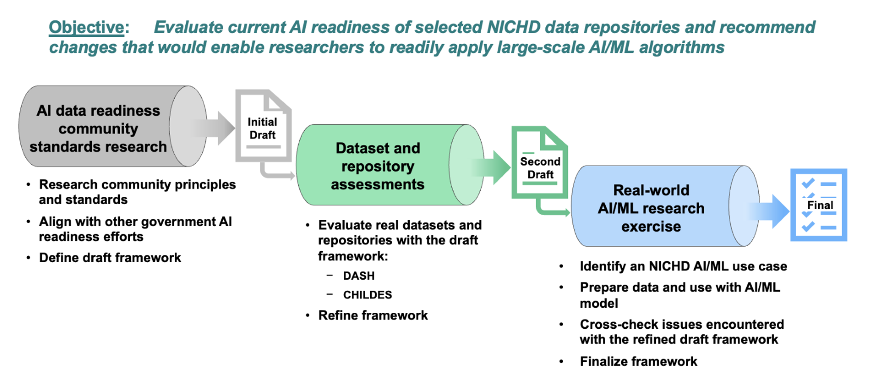

# E3: AI Data Readiness Framework

## The AI Data Readiness Framework is a resource for assessing the AI-readiness of data repositories.
 

## Table of Contents   
- [Effort Overview](#effort-overview) 
- [AI Data Readiness Framework](#air-table)
- [How to Use the Framework](#user-guide-how-to-use-the-framework)
- [Effort Documentation](#effort-documentation)
  

## Effort Overview 
The term “AI-ready” for data can be used to describe a single dataset, a single data repository, multiple repositories within a data ecosystem, or data from a given organization. This project tackled one important aspect of data being AI-ready: barriers that may exist within collections of data that would hinder the use of those data for the creation of large, AI-ready datasets. The AI Data Readiness framework is intended to be used to understand challenges or obstacles faced when combining data within NICHD-relevant repositories.
 
Developing the AI Data Readiness framework was iterative and consisted of three major steps:
 
* researching the current state-of-literature on “AI readiness” to develop an initial draft
* evaluating studies with real data in existing NICHD-relevant data repositories to refine the draft framework
* collecting and preparing data and using an AI/ML model to answer a notional research question (i.e. executing an AI/ML exercise) to cross-check the refined framework and arrive at a final AI Data Readiness framework
 
Applying the framework to assess a data repository should promote an understanding of the difficulties researchers will likely encounter in combining individual data files or studies within the repository into datasets ready to be ingested by AI/ML models. Results from an assessment can be used to inform data repository submission guidelines and requirements and/or repository curation processes to enhance the utility of repository datasets in AI/ML models.
  

### Details: 
* <b> Created by:</b> *Eunice Kennedy Shriver* National Institute of Child Health and Human Development (NICHD) Office of Data Science and Sharing (ODSS)  
* <b> NIH contacts:</b>
    * Rebecca Rosen, Director, NICHD ODSS
    * Valerie Cotton, Deputy Director, NICHD ODSS
    * Elizabeth Clerkin, Data Science and Policy Specialist, NICHD ODSS 

Primary contact:</b> [NICHDecosystem@nih.gov](mailto:NICHDecosystem@nih.gov?subject=Ecosystem_Library) 

## AI Data Readiness Framework 

| Category | Metric | Scoring |
|------------|------------|--------|
|**Accessible**: Data should be reasonably accessible to researchers|**Computable Formats** – All data and metadata should be in computable formats.    *Rationale*: Formats that allow immediate ingestion into code without adjustment decrease the time spent preparing data for analysis. It is difficult to anticipate the workflows that practitioners and researchers have developed for their use and how they ingest metadata and data. Therefore, all accompanying files should be available in a standard, computable format for easier integration into workflows. This includes but is not limited to: data files, data/dataset dictionaries, and study protocols.|0: Data and metadata are not in computable formats   1. All data are in computable formats, but some metadata are not (e.g. pdf or other formats not easily ingested into code)    2: All data and metadata are in computable formats (some descriptive documents may still be in pdf formats) |
|**Accessible**: Data should be reasonably accessible to researchers|**Data Samples** ­- Representative data are accessible without going through a controlled data access process.   *Rationale*: Samples of data allow researchers to plan their study scope and computational approach. Data access may be restricted in controlled access data repositories, which significantly limits the ability for users to assess the pertinence of each dataset for their intended use without substantial analysis of open access accompanying documentation. The inclusion of open access representative data samples, which need only be synthetic in nature, should contain all data variables and include representative values to allow for quicker and more effective assessments of data characteristics. Even for repositories where all data is open, and no access protocol is required, it can still be beneficial to have access to data samples that are substantially smaller than the full datasets. Data samples may be provided by the submitter or repository.  If data samples are provided by the submitter to a controlled access data repository, the submitter and/or the repository should review the data samples to ensure they are comprehensive, and the submitter should attest  that openly sharing the data samples does not violate participant privacy. |0: No open access data samples present   1:  Open access data samples are downloadable and in a computable format   2: Open access data samples are downloadable and in a computable format + easily viewable and manipulated in the browser |
|**Accessible**: Data should be reasonably accessible to researchers|**Example Code** – Example code, showing how to use the data, such as reading in, manipulating, or combining within a study, and sufficient documentation are available to users.   *Rationale*: Example code is important to allow researchers to understand how to process data formats more quickly than reading documentation. |0: No example code present   1: Code to use data and metadata is downloadable   2: All code to use data and metadata included in GitHub, or similar open access repository, with comprehensive documentation  |
|**Accessible**: Data should be reasonably accessible to researchers|**Searchable** – Data and metadata should be indexed and searchable.  *Rationale*: Researchers must first search for data that matches their needs. If data and metadata are not indexed and searchable, web search engines and search tools native to the data repositories cannot fully utilize dataset information to return optimal search results. |0: Datasets cannot be searched for by indexed metadata or data characteristics and must be browsed   1: Dataset metadata is indexed and can be searched by keywords   2: Dataset metadata is indexed and can be searched by keywords, and data is searchable by data characteristics, such as demographic, site, drug class, specific drugs, and other pertinent characteristics for biomedical research |
|**Metadata**: Data origin and content should be clear. |**Basic Information** – Necessary high-level dataset information aligning with the following  concepts should be present. These are high-level concepts and not prescriptive metadata elements.   - Data submitter contact information  - Data source, i.e. how the data was generated  - Date the data was generated  - Date the data was submitted  - Reason for missing or omitted data  - Supporting software used to generate the data, if applicable.    *Rationale*: This information establishes background and contact information regarding the dataset, rather than describing the dataset itself. This information is important to include as it adds a starting point for researchers to better understand the data and what steps they can take if they have questions about the data.   |0: No basic information provided  1: Basic information covering some concepts in the list provided  2: Basic information for all concepts in the list provided   |
|**Metadata**: Data origin and content should be clear. |**Data Documentation** – Sufficient information should be available to describe the data, usually in a “data dictionary.” This may be a single file (preferable) or set of files. It includes information about variable names/types, data meanings, and general data formatting.   *Rationale*: Researchers must be provided with adequate information regarding data characteristics if they are to effectively determine the suitability of the data for their research question and properly use the data in a research study. Data dictionaries, for example, have become standard in modern data ecosystems to allow for a succinct and structured overview of dataset structure and the variables within it. It typically takes the form of a table with variable names, variable types, attributes, and definitions, enabling users to gain a broader understanding of the data. Additional information may be provided in PDF files, for example, with information describing data collection protocols and more detailed explanation of variables. | 0: No data documentation present   1: Data documentation is downloadable but is not comprehensive   2: Comprehensive data documentation outlining the entire dataset is downloadable    |
|**Metadata**: Data origin and content should be clear. |**Lineage of Operations** – If any operations, transformations, and/or augmentations have been applied to the data, this record should be documented and available.   *Rationale*: Data submitters often have to process their data before uploading to a repository. This processing may take the form of converting hand notes to text, reformatting data into acceptable file formats, handling duplicated data, or deidentifying data. These steps should all be properly documented and conveyed to the researcher in order to enhance transparency and enable scientists to fully understand and analyze the provided data.  | 0: No lineage of operations recorded/disclosed   1: Incomplete lineage of operations is provided   2: Complete lineage of operations with appropriate documentation is provided   |
|**Metadata**: Data origin and content should be clear. |**Usage** – Clear and comprehensive information on how the data was used in past research or clinical settings, or how the data is connected to scientific publications, should be documented and available.    *Rationale*: An understanding of how the data has already been utilized enables researchers to improve the efficiency and effectiveness of their own methods. | 0: No information on past usage disclosed   1: Some information on past usage included, but assessor is not confident that all uses are provided   2: All instances of past usage are provided, with links to the data, publications, or other sources of reputable documentation |
|**Data Profile**: Data should be well-described.  |**Dataset Statistics** – Statistics and distributions of important dataset characteristics as a whole, such as dataset size, number of data points, numbers of cases or conditions, and numbers of test/lab results.   *Rationale*: Overview statistics convey important data dimensions that quickly allow researchers to determine the suitability of the underlying data to answer their research question.  | 0: No dataset statistics provided   1: Basic statistics provided for most items (checklist): Number of participants, number of total measurements, statistics of measurements per participant (mean, median, max, min, and standard 	deviation), and the total size of each data file (in bytes)   2: Basic statistics provided + charts and visualizations |
|**Data Profile**: Data should be well-described.  |**Variable Statistics** – Variable-level summary statistics and distributions of tabular data should be reported and visualized   *Rationale*: Variable Statistics allow researchers to understand the data at a deeper level, improving the researcher’s ability to determine suitability for their use case. | 0: No variable-level statistics provided   1: Basic variable-level statistics provided for most items (checklist): min, max, mean, median, standard deviation, % missing (note that the reasons for missingness are a component of “Basic Information”),  frequencies for categorical variables, and correlation analysis.   2: Basic variable-level statistics provided + charts and visualizations  |
|**Data Profile**: Data should be well-described.  |**Demographics (only applies to human study data)** – For datasets collected from or about humans, statistics and distributions of characteristics of participants such as sex, race and ethnicity, age, and socioeconomic status.   *Rationale*: All research participant characteristics that could lead to biases in conclusions or outcomes based on participant characteristics should be quantified and reported to enable high-quality research.  | 0: No demographic information is provided   1: Age, sex, race, and ethnicity of participants are quantified and reported   2: Age, sex, race, and ethnicity of participants are quantified and reported + socioeconomic factors are quantified and reported    |
|**Standardization**: Data should be assessed for standardization of terminology both within datasets comprising studies, and between datasets across the repository or repositories   |**Documentation Accuracy** – Data variables should match those expected from the study documentation (data documentation).   *Rationale*: If data documentation and data files do not match, there is a higher burden on the researcher to properly understand and process the data. Even one mismatch creates burden for the researcher verifying the data; therefore, the scoring for this metric is binary.  | 0: Data documentation and data files do not match   2: Data documentation and data files match     |
|**Standardization**: Data should be assessed for standardization of terminology both within datasets comprising studies, and between datasets across the repository or repositories   |**Terminology Consistency** – Ideally, terminology should be consistent between datasets used in AI/ML applications, whether those datasets are shared in one repository or across multiple. Standards may be repository-set or from an established field of research. Whenever possible, standard terminology should be used across datasets in order to minimize effort by researchers in combining data.    *Rationale*: Inconsistency in terminology, particularly in data variable names and within the data variables themselves (e.g. inconsistent medication units or conditions), forces researchers to parse each individual dataset’s associated documentation when properly merging data - significantly increasing the effort to do so. | 0: data not standardized within or across datasets relevant to the research question (or AI/ML application)   1: data standardized within datasets and across some datasets relevant to the research question (or AI/ML application)   2: data standardized within datasets and across all datasets relevant to the research question (or AI/ML application) |
|**Standardization**: Data should be assessed for standardization of terminology both within datasets comprising studies, and between datasets across the repository or repositories   |**Established Standards** – Terminology, both for data variable names and for the data themselves,  should be consistent with any existing or established data standards for relevant fields of research (such as those described on NICHD’s [Data Standards webpage](https://www.nichd.nih.gov/about/org/od/odss/data_standards)), where appropriate. This metric would not apply where no established standards exist. For practical application, the repository could require the researcher to state if there are standards they are aware of relevant to their dataset, and if so, document which ones were used (e.g., in the Data Dictionary). This could be verified by the repository, and other mechanisms for feedback could be instituted, such as allowing users of the data to report inconsistencies between the stated standards used and what they observe in the data.   *Rationale*: Using established data standards like terminologies defines the semantic or contextual meaning of data in a consistent way making the data easier to understand, combine, and use within and across repositories.  |0: no reference to established standards is provided   1: dataset references some established data standards, but not at all levels (e.g., metadata follows a standard, but participant-level variables do not)   2: dataset conforms with any established data standards at all levels  |

 

##  How to use the framework

Follow these three steps to use the AI Data Readiness Framework to assess a repository or a data ecosystem:
1.	Select a collection of datasets within a repository, or across multiple repositories for assessment
2.	Complete a detailed human review of the data and metadata for the selected dataset 
3.	Score the datasets according to the metric definitions. 

Assessment for many data repositories will require some degree of data download and analysis locally in order to adequately apply the framework.

For the metrics that apply to single datasets, multiple datasets should be assessed to capture insights about a given repository. Especially if the datasets within a repository are diverse in terms of types of data content, multiple individual datasets should be scored to provide a sufficiently comprehensive picture of the current AI data readiness of the repository. For example, if five datasets are assessed, and some score well on *Data Documentation* and some poorly, it can be inferred that *Data Documentation* is either not required or not enforced by the repository. In addition, if scores for a particular metric are consistently low across datasets, the inference is that the repository processes or requirements likely need improvement. However, assessing only a subset of datasets within a repository, instead of running a general script throughout, introduces a risk of bias. It is important to assess a diverse sample of datasets in order to provide a complete picture of the repository’s AI data readiness, as opposed to the AI readiness of a particular type of data within the repository. 

  

## Effort Documentation 

### Methods  
Development of the framework was a result of a 3-step approach that investigated current community AI-readiness standards, evaluated existing NICHD-relevant datasets and repositories, and applied an AI/ML model based on real-world research questions. This process is outlined in **Figure 1**.

 

 

 <b>Figure 1</b> illustrates the framework design methodology.  

We executed three key steps to develop the AI Data Readiness framework: 1) research into current community AI-readiness standards, with an emphasis on government efforts, 2) a data and repository assessment that included a review of datasets in two NICHD-relevant repositories, selected to represent distinct data types and researcher communities, and finally, 3) gathering and preparing data in an AI/ML exercise to tackle  real-world research questions. These three steps allowed us to create a draft framework after step one and then iteratively evaluate and improve on the draft framework in steps two and three to arrive at a finalized framework.

 

### Framework Characteristics
Through standards research and discussion it was determined the AI Data Readiness framework should satisfy the following characteristics: 

* *Be application-agnostic*: The framework should seek to evaluate the degree to which data is ready to be combined and used in AI/ML model creation and analysis workflows but not the degree to which it is suitable to answer specific scientific questions. Suitability should be determined by the researcher intending to use the data and where there may be scientific requirements that cannot be specified by this type of framework, such as class imbalance for a categorical ML model.  

* *Be repository-agnostic*: The framework should be able to be applied to analyze the AI readiness of data in any NICHD-relevant data repositories. While some tailoring to different repositories may be unavoidable, metric definitions should not be so specific that they cannot be applied broadly, as much as possible. 

* *Numerically score datasets / repositories*: The framework should include scoring, which will enable scalable and semi-quantitative assessments across NICHD’s data ecosystem. A secondary goal is the identification of what changes would be necessary for the repository or dataset to become more AI-ready. Scores should be complemented with qualitative descriptions to explain the rationale behind the score or elaborate on features not fully captured by the score itself. 

* *Minimize subjectivity*: While any system that relies on humans to interpret definitions and assign scores will include some subjectivity, wherever possible, the scoring definitions and examples provided should be constructed so as to minimize subjectivity in the assessment. 

It was determined that a framework that yielded quantitative scores as well as qualitative explanations would be more beneficial for NICHD’s goals, as it allows for easier comparisons across a large number of repositories while providing the context needed to make improvements in specific areas. 

### Principles for Metric Inclusion

#### Data Governance vs. AI Data Readiness
Metrics of data governance were excluded from the framework. Data governance refers to the collective set of rules and controls that define and enforce how data are handled across the data lifecycle including: appropriate data collection, sharing, linking, access, and use.  Data governance is important for protecting participant privacy and managing risks but may result in difficulties in finding, accessing, and using data (e.g., limiting what data can be openly searched, waiting for approval to use a controlled access dataset).  To ensure the framework measures AI data readiness, rather than features of data governance meant to protect the data, the framework focused on the ability to prepare data specifically for machine learning and AI tasks by ensuring proper formatting, clear documentation, and usable metadata. Although related, data governance and AI readiness address different needs—governance enforces appropriate handling and compliance, while readiness ensures data is actionable for AI.

#### Infrastructure/Organizational Capabilities vs. AI Data Readiness
Infrastructure and organizational capabilities refer to the combination of technical systems (storage, computation, networks), software platforms, governance frameworks, and human competencies (skills, processes, management) that collectively enable effective data handling, analysis, and deployment of AI solutions within an organization.

Infrastructure and organizational capabilities, for both data repositories and end users, are outside the scope of AI Data Readiness when explicitly defined in terms of formatting and documentation because these broader factors lie within the environments surrounding the data—beyond the direct characteristics of datasets themselves.

#### Other Excluded Metrics
Some characteristics, while pertinent to the measure of AI Data Readiness, were excluded from the framework due to their immeasurable or highly subjective nature. Metrics that were considered but ultimately excluded include:

1.	Ease of Manipulation - an acceptable way to measure this could not be found.
2.	Completeness - there does not exist a generalizable threshold at which missing data would render a given dataset not AI-ready. Completeness often depends on the scientific question. 
3.	Duplicates - there does not exist a generalizable threshold at which duplicate data would render a given dataset not AI-ready. This also often depends on the scientific question. 

 

### User stories:

The following User Stories motivated and informed [this Effort](https://github.com/NIH-NICHD-Ecosystem/UserStories/blob/main/README.md).

| S#  | User Story | Current Problem | User Goal | User |
|----|----|----|-----|---|
|62| As a researcher, I want to use DASH BPCA data to train, validate, and test an AI/ML model that predicts adverse events due to antibiotics for intra-abdominal infections in infants with the aim toward recommending the best antibiotic for a patient. | Today, I have no idea whether these data are "AI-ready" and how much time and effort it would take to prepare the data to develop, train, or use an AI/ML model. | My goal is to understand the AI-readiness of the data. | Researcher |
| 63 | As a researcher, I want to use transcripts of audio recordings from CHILDES to predict whether or not a child is a late talker. | Today, I have no idea whether these data are "AI-ready" and how much time and effort it would take to prepare transcript data to develop, train, or use an AI/ML model. | My goal is to understand the AI-readiness of the data. | Researcher |

